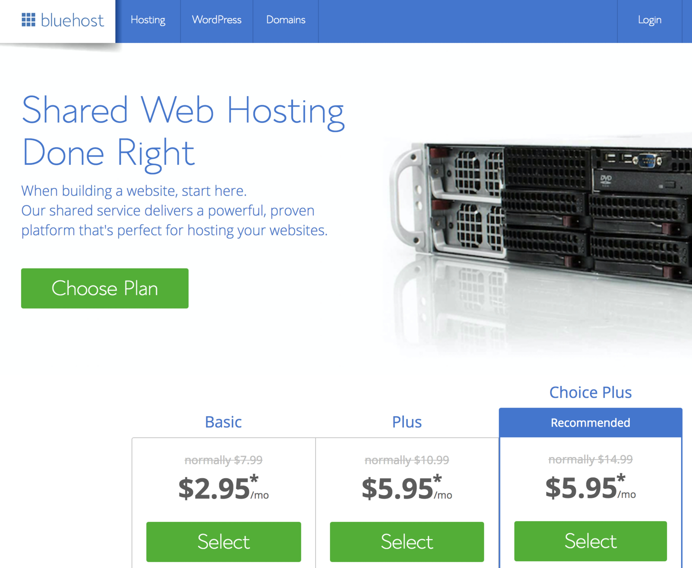
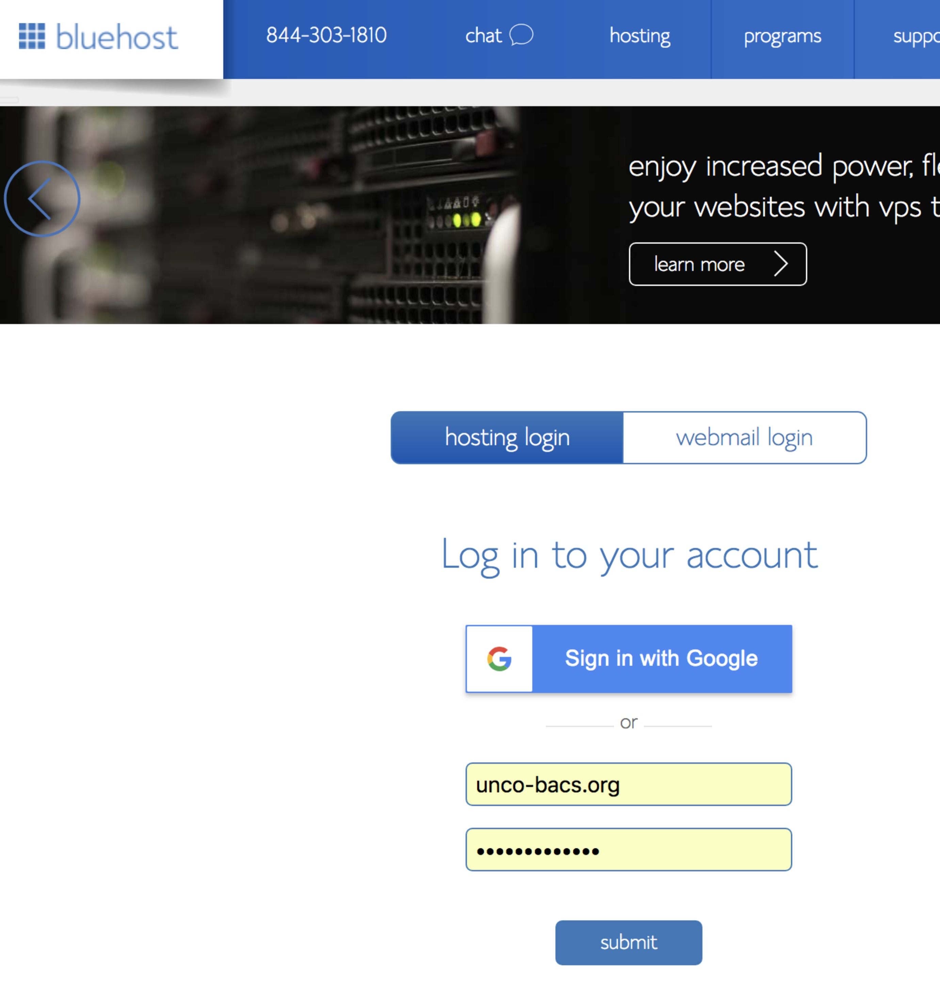
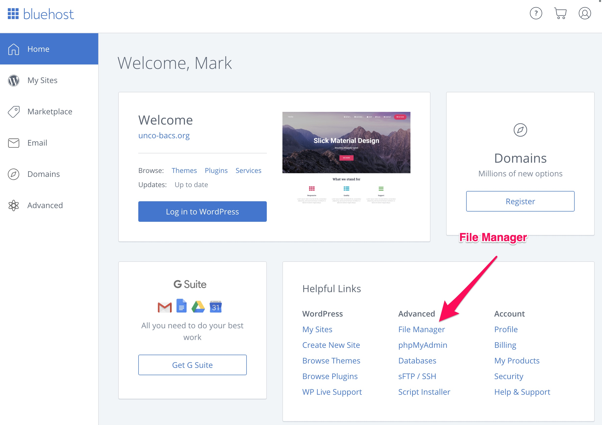
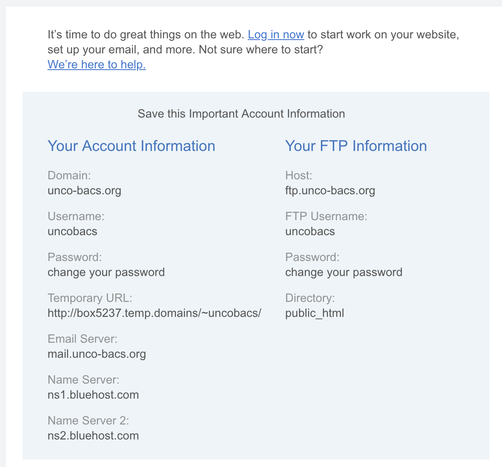

# Project #1 - Bluehost Web Hosting

## Goals

The purpose of this project is to implement web hosting using a commercial Web Hosting Service Provider.

First an account must be registered at Bluehost (or similar provider).

Your domain is registered and shows up on your student dashboard.

A WordPress application must be installed and configured.

A profile page must have your student name, photo, and skills.

### Goals
* Setup a web hosting account at Bluehost and setup WordPress
* Project will be graded in three parts (M W F)
* Project #1 - Setup Web Hosting 
    * **Part A - Sign up for Bluehost** - Due Mon, Jan 13 (graded on Tue, Jan 14)
    * **Part B - Publish a WordPress page** - Due Wed, Jan 15
    * **Part C - Create a profile page** - Due Fri, Jan 17

---

## Part A - Sign up for Bluehost - Due Mon, an 13

    
### Sign up for Bluehost Web Hosting
Register for web hosting

### Bluehost Domain Setup
Select a domain name to use.  You can also configure this later.

### Bluehost Login
Login to work on your website.

### Bluehost Portal
Lots of things you can do.

### Server URL
Find the email that looks like...

### Register Your Server
* Login with your Canvas Name (password: new)
* Register your machine domain name on the Class Website
* Verify that the machine is registered correctly
* This URL is how all of your projects will be graded

[Register Domain](https://shrinking-world.com/unc/bacs200)

## Part B - Publish WordPress page - Due Wed, Jan 15

### Configure your WordPress blog
* Login as Admin to your Bluehost Word Press site
* Create About the Author page
* Select a visual theme
* Disable "Coming Soon"
* Setup site title
* Set visual appearance theme

    
### Set Your Profile Info with Photo
* Create a new page
* "Your name" Profile
* Profile picture
* Your top skills - what are you selling
* Skills you are developing - what will you sell
* Aspirations - career goals

  
## Part C - Post a Blog Article - Due Fri, Jan 17

### Write Article "New Literacy"
* 250 Words
* What are the most popular social networking services and how are they unique?

### Test Your page
* Find your dashboard page
* Follow the link to your web site
* 404 or Page loads
* Use the link on your dashboard page to test your website
* Keep working until your page appears

### Peer Review
* You will be assigned to review 3 other students 
* You will also get feedback from 3 students on your work
* Reviews will be assigned on Friday

### Grading Your Page
* Grading will be done in three steps
* Grading will be done shortly after each due date
* You will have a chance to replace a low score

### Getting Help
* I will be available during class and office hours
* I will help you when you get stuck
* Be proactive and ask for help

---

## Requirements

* Page exists at YOUR_DOMAIN/index.php
* WordPress blog
* Coming Soon message has been replace with real content
* Title is set properly on the browser tab
* Profile Page has name and photo
* New Literacy page exists
* New Literacy article content (250 Words)
* Image is properly displayed
* Custom theme used
* Visual appearance is good

