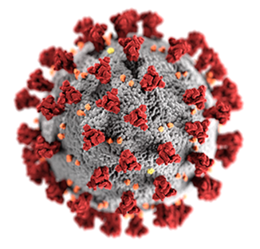

# Seaman Family News - Pandemic Edition

March 1 - March 31

by Mark Seaman

[Pandemic Blues Journal](./)

---

### Pandemic Paralyzes the World

Events have come upon us all so quickly and forcefully.  Our family has been self-quarantined since
March 13.   The governor of Colorado issued a "shelter in place" order for the 19th, but we have 
already been doing that.

### Stacie

Stacie wears so many hats I don't know where to start.

* Wife - the best one that anyone could imagine
* Mom - we see all our kids every day
* Grandma - we have two granddaughters and a grandson on the way
* Pastor - she takes care of many people in our church and small group
* Coach - she has a number of clients that she meets with monthly
* House manager - I can't imagine how much we would have to pay someone for this

### Christine

Our oldest daughter was working at King Soopers as a pharmacy technician. When the viral outbreak 
happened it became clear that this would be an extremely dangerous job.  She has problems with 
Asthma and would be seriously threatened if she were to contract the virus.  She resigned her job at
King Soopers after five years, and is currently helping with the household mananagement.

We are eating super well.  Our house seems to be full of great chefs. We've stocked up on supplies and
are getting regular reenforcements from Amazon.

### Josiah, Samantha, and Cassie

They moved back from England where Josiah is working on his PhD in bioinformatics. He is currently 
writing his dissertation and leading a multinational team of scientists to create a Pangenome Browser.
This tools lets geneticists organize information about the variations that occur in the DNA between 
multiple samples of the same species.

Once the COVID-19 crisis hit the world he has pivoted his research to work specifically with the 
COVID-19 virus. See the [website](https://graph-genome.github.io/)  for more details. He is currently
looking for software developers, semantic data experts, and marketing people to support this project.

The goal of the project is to understand the variations of COVID-19 active in the population 
and help ensure that the vaccine will be effective on the various strains.

Mark, Stacie, Christine, and Samantha have already been pressed into service on aspects of this project.

Samantha is working diligently on writing and making great progress.

Cassie is seven and out of school.  She is trapped in the house with five adults who are giving her
way too much supervision. She loves to draw and we play guitar together and make up songs.

### Rachel, Andrew, and Ruby

Rachel is our youngest daughter.  She is a fantastic Mom and is expecting her second child in July.
She is quite exhausted most days with the normal stress of an infant and pregnancy. 

Andrew is working in home health care.  Which also tends to be quite stressful. 

Ruby is 1 year old and learning new tricks every day. 

The Garcias just live a few miles away so we see them most days.

### Mark

Mark has been teaching at University of Northern Colorado for three years.  He has taught eight 
classes and 281 students to do web development.  He loves teaching and feels that he has found his 
life's calling.

The last in-person class at UNC was March 13, and now all classes are online.  This worked out well
since Mark had already built an entire system for teaching online.

He is slated to teach three class in the Fall of 2020.

---

Every day brings new challenges and new opportunities.  My Mom used to tell me, 
"Don't worry about tomorrow. Tomorrow will worry about itself!"

Be safe and don't forget to be awesome!

