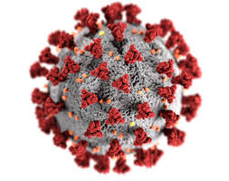
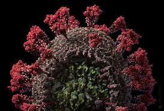
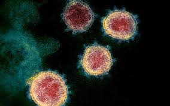

# Virus Modeling

## Images of SARS-CoV-2

This is the virus that causes the COVID-19 disease.

## Protein Folding Models

This virus reminds me of a death star.   The little spiky protrusions
can be thought of as the weapons array.

The DNA naturally causes a 3-D shape that is replicated.

Here is a model of the protein folding for the viral spikes based on the
exact sequence of the DNA proteins.

[Spike Protein Model](https://swissmodel.expasy.org/interactive/7dVLxC/models/03)

My Favorite view here is

* Model 2
* Surface drawing mode
* Use the mouse to move the model in 3-D
* Hit the play button and watch it rotate

Amazing symetry

